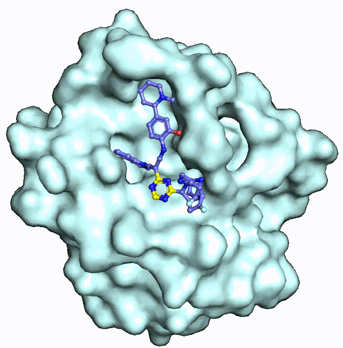

# AutoFBDD: An AI-Driven Fragment-Based Approach for Automated Small Molecule and PROTAC Generation with Applications in Drug Design
Official implementation of ***AutoFBDD***, a fragment-based model for de novo small molecule and PROTAC generation, by Qiaoyu Hu<sup>1,#</sup>, Yu Cao<sup>1</sup>, PengXuan Ren<sup>1</sup>, Xianglei Zhang<sup>1</sup>, Fenglei Li<sup>1</sup>, Xueyuan Zhang, Yongqi Zhou, Lianghe Mei<sup>#</sup>, and Fang Bai<sup>#</sup>.

<p align="center">
  <br>
  <strong>图1.</strong> AutoFBDD模型框架示意图
</p>

<table align="center">
  <tr>
    <td></td>
    <td></td>
    <td></td>
  </tr>
  <tr>
    <td colspan="3" align="center"><strong>图2.</strong>AutoFBDD片段对接及片段连接动态图</td>
  </tr>
</table>

<p align="center">
<br>
  <strong>图3.</strong> AutoFBDD生成PROTACs动态图
</p>

## Installation

### Install conda environment via yaml file
```bash
# Create the AutoFBDD environment
conda env create -f AutoFBDD.yml
# Activate the AutoFBDD environment
conda activate AutoFBDD

# Create the DeepPROTACs environment
conda env create -f DeepPROTACs.yml
# Activate the DeepPROTACs environment
conda activate DeepPROTACs
```

### Install Rosetta
Download the Rosetta software from [here](https://downloads.rosettacommons.org/downloads/academic/2020/wk08/).
Uncompress the file by running this command in terminal.
```bash
tar -xvzf rosetta_src_2020.08.61146_bundle.tgz
```
Now you can build Rosetta using this general command line.
```bash
cd rosetta_src_2020.08.61146_bundle/main/source
./scons.py -j 20 mode=release bin
```
`-j` is indicating how many cores you want to use. This number depends on your computer.

### Install pkcombu
```bash
cd eMolFrag
tar -xvzf kcombu-src-20200414.tar.gz
cd src
make -f Makefile.pkcombu
```
If the sources is successfully compiled, an execution file "pkcombu" will appear in the "../src" directory.

### Set environment variables
```bash
echo 'export AutoFBDD_FOL=your_path_to_AutoFBDD_folder' >> ~/.bashrc
echo 'export PATCHDOCK=your_path_to_patchdock_folder' >> ~/.bashrc
echo 'export ROSETTA_FOL=your_path_to_rosetta_folder' >> ~/.bashrc
echo 'export PATH=your_path_to_pkcombu_file:$PATH' >> ~/.bashrc
source ~/.bashrc
```
For example:
```bash
echo 'export AutoFBDD_FOL=/home/bailab/other/hqy/AutoFBDD' >> ~/.bashrc
echo 'export PATCHDOCK=/home/bailab/other/hqy/PatchDock' >> ~/.bashrc
echo 'export ROSETTA_FOL=/home/bailab/software/rosetta_src_2020.08.61146_bundle' >> ~/.bashrc
echo 'export PATH=/home/bailab/other/hqy/AutoFBDD/eMolFrag:$PATH' >> ~/.bashrc
source ~/.bashrc
```

## Brick library
You can download the brick library `brick_library.tar.gz` from [here](https://drive.google.com/drive/folders/1pQk1FASCnCLjYRd7yc17WfctoHR50s2r):
* `all`: the complete brick library filtered by similarity threshold of 1.0, the number of brick is 98,679.
* `all_0.8`: the brick library filtered by similarity threshold of 0.8, the number of brick is 93,340.
* `all_0.6`: the brick library filtered by similarity threshold of 0.6, the number of brick is 54,693.
* `all_0.4`: the brick library filtered by similarity threshold of 0.4, the number of brick is 16,005.

## Generation of small molecules
```bash
conda activate AutoFBDD
python AutoFBDD.py --mode linking --brick_mode brick --folder folder_name --input_pdb receptor.pdb --center center.txt --brickfolder all --brickfile_list bricks_file.txt --num_cpu 40 --sep_bricks 100 --top_clusters 10 --top_bricks 5 --dis_val 10 --poses 3
```
* `mode`: FBDD mode (linking or growing).
* `brick_mode`: brick mode (brick or mol). If you want to use brick_library or provide your own brickfolder, please specify brick in brick_mode. If you have a list of small molecules and want to cut them into bricks, please specify mol in brick_mode.
* `folder`: working folder name.
* `input_pdb`: input pdb file.
* `center`: pocket center file (xyz coordiantes of protein binding pocket center). An example is provided in /ifitdock/center.txt.
* `brickfolder`: brick folder. If you want to use our brick_library, please specify all or all_0.8 or all_0.6 or all_0.4. Otherwise, provide your own brick or molecule folder and put it in the AutoFBDD main folder.
* `brickfile_list`: brick file list, just give an empty txt file that can be used to store bricks.
* `num_cpu`: the number of cpu used in parallel run.
* `sep_bricks`: the number of bricks in each brick list file.
* `top_clusters`: the number of top fragment clusters saved.
* `dis_val`: threshold distance value of two bricks for brick linking.
* `poses`: the number of poses saved for each pair of linked or grown bricks.

## Generation of PROTACs
```bash
conda activate AutoFBDD
python AutoPROTACs.py --folder folder --target target.pdb --warhead_anchor_id num --E3_ligase E3_ligase.pdb --E3_ligand E3_ligand.mol2 --ligand_anchor_id num --min_dist 5 --max_dist 15 --num_cpu 20 --top_docking 100
```
* `folder`: working folder name.
* `target`: target protein file.
* `warhead_anchor_id`: warhead anchor ID, select anchor automatically if warhead_anchor_id is not specified or specified to be -1.
* `E3_ligase`: E3 ligase file.
* `E3_ligand`: E3 ligand file.
* `ligand_anchor_id`: E3 ligand anchor ID, select anchor automatically if ligand_anchor_id is not specified or specified to be -1.
* `min_dist`: the minimum length of linker.
* `max_dist`: the maximum length of linker.
* `num_cpu`: the number of cpu used in parallel run.
* `top_docking`: the number of top rosetta docking results extracted.

## Datasets
The benchmark datasets utilized in this project are PDBbind and CrossDocked.
### PDBbind
To train the model from scratch, you need to download the preprocessed lmdb file and split file from [here](https://drive.google.com/drive/folders/1pQk1FASCnCLjYRd7yc17WfctoHR50s2r):
* `PDBbind_v2020_pocket10_processed_final.lmdb`
* `PDBbind_pocket10_split.pt`

To process the dataset from scratch, you need to download PDBbind_v2020 from [here](http://www.pdbbind.org.cn/download.php), save it in `data`, unzip it, and run the following scripts in `data`:
* [clean_pdbbind.py](data/clean_pdbbind.py) will clean the original dataset, extract the binding affinity and calculate QED, SA, LogP, and TPSA of ligands. It will generate a `index.pkl` file and save it in `data/PDBbind_v2020` folder. *You don't need to do these steps if you have downloaded .lmdb file.*
    ```bash
    python clean_pdbbind.py --source PDBbind_v2020
    ```
* [extract_pockets.py](data/extract_pockets.py) will extract the pocket file from a 10 A region around the binding ligand in the original protein file.
    ```bash
    python extract_pockets.py --source PDBbind_v2020 --desti PDBbind_v2020_pocket10
    ```
* [split_dataset.py](data/split_dataset.py) will split the train, validation and test set.
    ```bash
    python split_dataset.py --path PDBbind_v2020_pocket10 --desti PDBbind_pocket10_split.pt --train 17327 --val 1825 --test 100
    ```

### CrossDocked
To train the model from scratch, you need to download the preprocessed lmdb file and split file from [here](https://drive.google.com/drive/folders/1pQk1FASCnCLjYRd7yc17WfctoHR50s2r):
* `crossdocked_v1.1_rmsd1.0_pocket10_processed_final.lmdb`
* `crossdocked_pocket10_pose_split.pt`

To process the dataset from scratch, you need to download CrossDocked2020 v1.1 from [here](https://bits.csb.pitt.edu/files/crossdock2020/), save it in `data`, unzip it, and run the following scripts in `data`:
* [clean_crossdocked.py](data/clean_crossdocked.py) will filter the original dataset and retain the poses with RMSD < 1 A. It will generate a `index.pkl` file and create a new directory containing the filtered data (corresponds to `crossdocked_v1.1_rmsd1.0.tar.gz` in the drive). *You don't need these files if you have downloaded .lmdb file.*
    ```bash
    python clean_crossdocked.py --source CrossDocked2020 --dest crossdocked_v1.1_rmsd1.0 --rmsd_thr 1.0
    ```
* [extract_pockets.py](data/extract_pockets.py) will extract the pocket file from a 10 A region around the binding ligand in the original protein file.
    ```bash
    python extract_pockets.py --source crossdocked_v1.1_rmsd1.0 --dest crossdocked_v1.1_rmsd1.0_pocket10
    ```
* [split_dataset.py](data/split_dataset.py) will split the training and test set. We use the split file `split_by_name.pt`, which can be downloaded [here](https://drive.google.com/drive/folders/1pQk1FASCnCLjYRd7yc17WfctoHR50s2r).
    ```bash
    python split_dataset.py --path data/crossdocked_v1.1_rmsd1.0_pocket10 --dest data/crossdocked_pocket10_pose_split.pt --fixed_split data/split_by_name.pt
    ```

## Training
### Trained model checkpoint
The trained model checkpoint files are stored in [here](https://drive.google.com/drive/folders/1pQk1FASCnCLjYRd7yc17WfctoHR50s2r).
* `trained.pt` is the checkpoint file trained on the PDBbind dataset with labeling.
* `bond_trained.pt` is the checkpoint file of bond predictor trained on the PDBbind dataset. This should be used as guidance during the sampling process.

### Training from scratch
```bash
python scripts/train.py --config configs/train/train.yml
```
If you want to resume the training, you need to revise the train.yml file. Set `resume` to True and set `resume_ckpt` to the checkpoint that you want to resume, eg. 100000.pt. In addition, `log_dir` should be defined by `args.logdir` (the previous training directory) instead of using `get_new_log_dir` function.

### Training bond predictor
```bash
python scripts/train_bond.py --config configs/train/train_bond.yml
```

## Inference
```bash
python scripts/sample.py --config configs/sample/sample.yml
```
Place the downloaded or self-trained checkpoint files in the `ckpt` folder.

The values of logp, tpsa, sa, qed, aff can be adjusted to generate molecules with desired properties.
* `logp` is octanol-water partition coefficient. It ranges from -2.0 to 5.0. High value indicates hydrophobicity and low value indicates hydrophilicity. The logp values of most drugs are located between 1.0 and 3.0.
* `tpsa` is topogical polar surface area. High value indicates high water solubility and low value indicates high lipid solubility. The tpsa values of most drugs are located between 20 and 60.
* `sa` is synthetic accessibility. It ranges from 0.0 to 10.0. The lower the sa value, the easier the organic synthesis. The reasonable sa values of most drugs are located between 0.0 and 5.0.
* `qed` is quantitative estimate of drug-likeness. It ranges from 0.0 to 1.0. The higher the qed value, the greater the drug-likeness.
* `aff` is binding affinity. It is calculated by -log10(*K<sub>d</sub>* or *K<sub>i</sub>* or *IC<sub>50</sub>*). High value indicates high binding affinity. For instance, 8.0 corresponds to 10 nM *K<sub>d</sub>* or *K<sub>i</sub>* or *IC<sub>50</sub>*.

### Sample molecules for given protein pocket
Revise the sample.yml file to sample molecules for any given protein pocket. Set `target` to pocket file (eg. sample/3ztx_pocket.pdb) and set `mode` to pocket.

### Sample molecules for all pockets in test set
Revise the sample.yml file to sample molecules for all pockets in test set. Set `target` to None and set `mode` to test.

### Sample molecules based on given fragments (lead optimization)
Revise the sample.yml file to sample molecules based on given fragments. Set `target` to pocket file (eg. sample/3ztx_pocket.pdb), set `frag` to fragment file (eg. sample/3ztx_frag.sdf), set `gen_mode` to frag_cond or frag_diff, and set `mode` to pocket.

## Evaluate
```bash
python scripts/evaluate.py --config configs/eval/eval.yml
```
The docking mode can be chosen from {qvina, vina_score, vina_dock, none}.

## Citation
