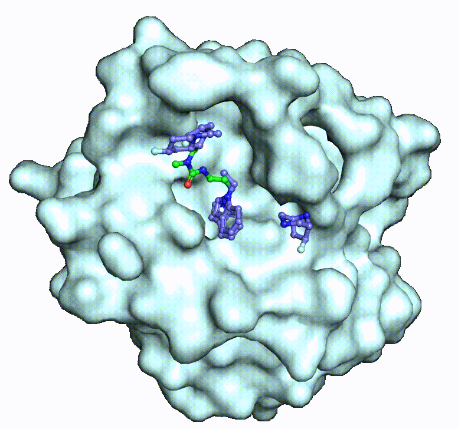
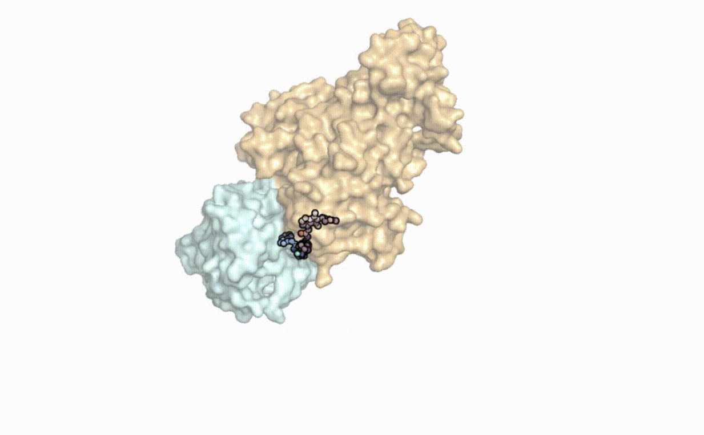

# DeepDegradome: A Structure-Aware Deep Learning Framework for *De Novo* PROTAC and Ligand Generation Against Druggable and Undruggable Targets
Official implementation of ***DeepDegradome***, a fragment-based model for *de novo* small molecules and PROTACs generation, by Qiaoyu Hu<sup>1,#</sup>, Yu Cao<sup>1</sup>, PengXuan Ren<sup>1</sup>, Xianglei Zhang<sup>1</sup>, Fenglei Li<sup>1</sup>, Xueyuan Zhang, Fengyu Cai, Ran Zhang, Yongqi Zhou, Lianghe Mei<sup>#</sup>, and Fang Bai<sup>#</sup>.

<p align="center">
  <br>
  <strong>Fig 1.</strong> DeepDegradome framework
</p>

<table align="center">
  <tr>
    <td></td>
    <td></td>
    <td></td>
  </tr>
  <tr>
    <td colspan="3" align="center"><strong>Fig 2.</strong> Animation of fragment docking and linking</td>
  </tr>
</table>

<p align="center">
<br>
  <strong>Fig 3.</strong> Animation of PROTACs generation
</p>

## Installation

### Install conda environment via yaml file
```bash
# Create the DeepDegradome environment
conda env create -f DeepDegradome.yaml
# Activate the DeepDegradome environment
conda activate DeepDegradome

# Create the DeepPROTACs environment
conda env create -f DeepPROTACs.yaml
# Activate the DeepPROTACs environment
conda activate DeepPROTACs
```

### Install Rosetta
Download the Rosetta software from [here](https://downloads.rosettacommons.org/downloads/academic/2020/wk08/).
Uncompress the file by running this command in terminal.
```bash
tar -xvzf rosetta_src_2020.08.61146_bundle.tgz
```
Now you can build Rosetta using this general command line.
```bash
cd rosetta_src_2020.08.61146_bundle/main/source
./scons.py -j 20 mode=release bin
```
`-j` is indicating how many cores you want to use. This number depends on your computer.

### Install pkcombu
```bash
cd eMolFrag
tar -xvzf kcombu-src-20200414.tar.gz
cd src
make -f Makefile.pkcombu
```
If the sources is successfully compiled, an execution file "pkcombu" will appear in the "../src" directory.

### Set environment variables
```bash
echo 'export DeepDegradome_FOL=your_path_to_AutoFBDD_folder' >> ~/.bashrc
echo 'export PATCHDOCK=your_path_to_patchdock_folder' >> ~/.bashrc
echo 'export ROSETTA_FOL=your_path_to_rosetta_folder' >> ~/.bashrc
echo 'export PATH=your_path_to_pkcombu_file:$PATH' >> ~/.bashrc
source ~/.bashrc
```
For example:
```bash
echo 'export DeepDegradome_FOL=/home/bailab/other/hqy/AutoFBDD' >> ~/.bashrc
echo 'export PATCHDOCK=/home/bailab/other/hqy/PatchDock' >> ~/.bashrc
echo 'export ROSETTA_FOL=/home/bailab/software/rosetta_src_2020.08.61146_bundle' >> ~/.bashrc
echo 'export PATH=/home/bailab/other/hqy/AutoFBDD/eMolFrag:$PATH' >> ~/.bashrc
source ~/.bashrc
```

## Brick library
You can download the brick library `brick_library.tar.gz` from [here](https://drive.google.com/drive/folders/1pQk1FASCnCLjYRd7yc17WfctoHR50s2r):
* `all`: the complete brick library filtered by similarity threshold of 1.0, the number of brick is 98,679.
* `all_0.8`: the brick library filtered by similarity threshold of 0.8, the number of brick is 93,340.
* `all_0.6`: the brick library filtered by similarity threshold of 0.6, the number of brick is 54,693.
* `all_0.4`: the brick library filtered by similarity threshold of 0.4, the number of brick is 16,005.

## Generation of small molecules
```bash
conda activate DeepDegradome
python DeepDegradome_ligands.py --mode linking --brick_mode brick --folder folder_name --input_pdb receptor.pdb --center center.txt --brickfolder all --brickfile_list bricks_file.txt --num_cpu 40 --sep_bricks 100 --top_clusters 10 --top_bricks 5 --dis_val 6 --poses 3
```
* `mode`: FBDD mode (linking or growing).
* `brick_mode`: brick mode (brick or mol). If you want to use brick_library or provide your own brickfolder, please specify brick in brick_mode. If you have a list of small molecules and want to cut them into bricks, please specify mol in brick_mode.
* `folder`: working folder name.
* `input_pdb`: input pdb file.
* `center`: pocket center file (xyz coordiantes of protein binding pocket center). An example is provided in /ifitdock/center.txt.
* `brickfolder`: brick folder. If you want to use our brick_library, please specify all or all_0.8 or all_0.6 or all_0.4. Otherwise, provide your own brick or molecule folder and put it in the AutoFBDD main folder.
* `brickfile_list`: brick file list, just give an empty txt file that can be used to store bricks.
* `num_cpu`: the number of cpu used in parallel run.
* `sep_bricks`: the number of bricks in each brick list file.
* `top_clusters`: the number of top fragment clusters saved.
* `top_bricks`: the number of top bricks saved in each cluster.
* `dis_val`: threshold distance value of two bricks for brick linking.
* `poses`: the number of poses saved for each pair of linked or grown bricks.

## Generation of PROTACs
```bash
conda activate DeepDegradome
python DeepDegradome_PROTACs.py --folder folder --target target.pdb --warhead_anchor_id num --E3_ligase E3_ligase.pdb --E3_ligand E3_ligand.mol2 --ligand_anchor_id num --min_dist 5 --max_dist 15 --num_cpu 20 --top_docking 50
```
* `folder`: working folder name.
* `target`: target protein file.
* `warhead_anchor_id`: warhead anchor ID, select anchor automatically if warhead_anchor_id is not specified or specified to be -1.
* `E3_ligase`: E3 ligase file.
* `E3_ligand`: E3 ligand file.
* `ligand_anchor_id`: E3 ligand anchor ID, select anchor automatically if ligand_anchor_id is not specified or specified to be -1.
* `min_dist`: the minimum length of linker.
* `max_dist`: the maximum length of linker.
* `num_cpu`: the number of cpu used in parallel run.
* `top_docking`: the number of top rosetta docking results extracted.

## Evaluation of generated PROTACs
```bash
conda activate DeepPROTACs
python DeepPROTACs.py --folder folder --target target.pdb --E3_ligase E3_ligase.pdb --top_docking 50
```
* `folder`: working folder name.
* `target`: target protein file.
* `E3_ligase`: E3 ligase file.
* `top_docking`: the number of top rosetta docking results extracted. This value must match the 'top_docking' parameter specified in the AutoPROTACs arguments.

## Citation
Please consider citing our paper if you find it helpful. Thank you!
